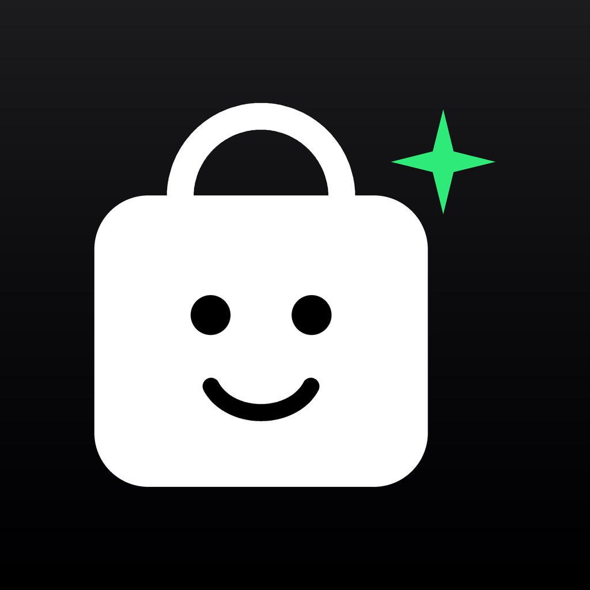

# My Closet

My Closet by Tolstoy LTD connects an assistant to a private digital closet. Save clothes you own, find their saved descriptions, remove selected items, and request a private link to continue in Shopbots.

This package uses the Agent Plugins 1.0.0 format. Its technical identifier is `my-closet`, version `0.1.0`. It contains one workflow skill and one remote MCP connection. The server runs on Tolstoy's production service; this package has no local server, executable scripts, or embedded UI.

## Connection and configuration

Load the package using a client that supports Agent Plugins 1.0.0. Clients discover the workflow under `skills/closet/SKILL.md` and the connection in root `mcp.json`.

The production endpoint is:

`https://apilb.gotolstoy.com/mcp/v1/closet/mcp`

The transport is Streamable HTTP. The server uses OAuth authorization code flow with dynamic client registration and S256 PKCE. No API key, password, or client secret is included in this package.

Start authentication from the client. When the client opens the Tolstoy guest-consent page, select **Connect closet** and return to the client. The consent page requires the session created by the connection; opening its URL directly does not connect a closet. Guest closet use needs no email, merchant workspace, or Shopbots account.

Approve tool use when your client asks.

## Usage

Example prompts:

- "I own a navy cotton shirt in size M and blue straight-leg jeans in size 30. Save both in my closet."
- "Find my blue clothes."
- "Remove my navy cotton shirt from my closet. Keep my jeans."
- "Give me a link to continue with this closet in Shopbots."

The server exposes `add_closet_items`, `search_closet`, `remove_closet_items`, and `get_shopbots_link`. Search uses saved text. Use exact returned item IDs for removal. Deleting a closet record does not delete its copied photo.

The Shopbots link is private and expires after 24 hours. Sharing the closet with a Shopbots account requires separate sign-in and confirmation. Creating a link does not complete account linking.

## Limits

The service does not provide virtual try-on, image generation, mailbox import, or in-place garment editing. It does not search image contents.

Photo input depends on the client. In ChatGPT, one photo request can save separate text-only and photo entries. The stored photo renders correctly. Check the saved items and ask the assistant to remove any unwanted duplicate.

The local package, OAuth connection, tool discovery, and an unfiltered closet search have been verified in Cursor. Attached-photo transfer in Cursor and installation, OAuth, tool use, and photo transfer in Grok Bot have not yet been tested.

## Help and policies

- Publisher: [Tolstoy LTD](https://www.gotolstoy.com)
- Support: [Tolstoy Help Center](https://help.gotolstoy.com/en/)
- [Privacy policy](https://www.gotolstoy.com/privacy-policy)
- [Terms of use](https://www.gotolstoy.com/terms-of-use)

If connection fails, start it again from the client and report the client and error through the Help Center. Do not share OAuth tokens or a private Shopbots continuation link in a public report.
